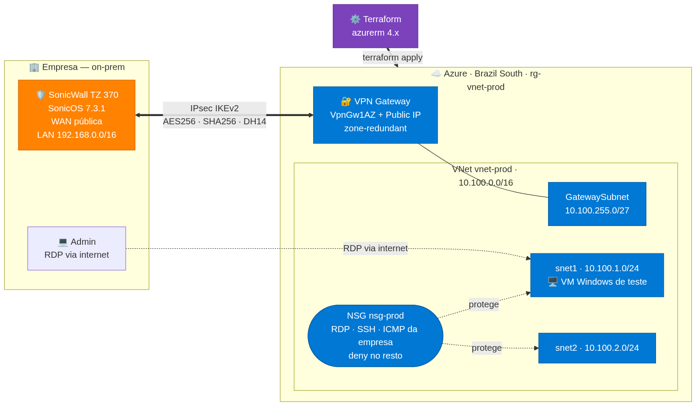
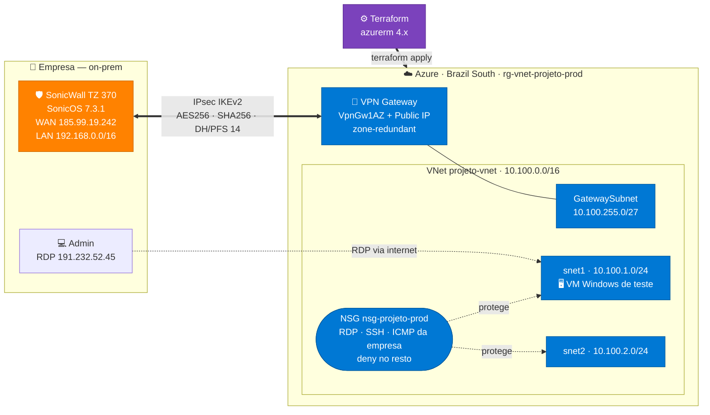

# VNet + VPN Site-to-Site — Azure (prod)

Deploy de produção que provisiona uma VNet na Azure e um túnel **Site-to-Site IPsec** conectando a rede da empresa (SonicWall TZ 370 / SonicOS 7.3.1) à Azure.

- **Região:** Brazil South (São Paulo)
- **Cloud:** Azure (provider `azurerm ~> 4.0`)
- **Backend de state:** `azurerm` (`rg-state-projeto` / `remotestateprojeto` / container `tfstate-projeto`)

## Arquitetura

<p align="center">
  
  &nbsp;&nbsp;&nbsp;&nbsp;&nbsp;&nbsp;
  
  &nbsp;&nbsp;&nbsp;&nbsp;&nbsp;&nbsp;
  
</p>
<p align="center">
  <strong>SonicWall TZ 370</strong> &nbsp;·&nbsp; provisionado por <strong>Terraform</strong> &nbsp;·&nbsp; <strong>Microsoft Azure</strong>
</p>

<p align="center">
  
</p>

<details>
<summary>Código-fonte do diagrama (Mermaid — editável)</summary>



Para regenerar o PNG após editar o diagrama:
```bash
B64=$(base64 -w0 docs/arquitetura.mmd)
curl -s -o docs/arquitetura.png "https://mermaid.ink/img/${B64}?type=png&bgColor=ffffff&width=1600"
```

</details>

> Fluxo: a `VM de teste` em `snet1` alcança a rede `192.168.0.0/16` da empresa pelo túnel; o admin faz RDP pela internet no IP público da VM (origem liberada no NSG). O Terraform provisiona toda a infra Azure.

## Recursos criados

| Arquivo | Recursos |
|---|---|
| `network.tf` | Resource Group, VNet, subnets `snet1`/`snet2` e `GatewaySubnet` (recursos nativos `azurerm`) |
| `vpn.tf` | Public IP (Standard/Static), VPN Gateway (VpnGw1AZ), Local Network Gateway, Connection IPsec + instruções do SonicWall |
| `nsg.tf` | NSG `nsg-projeto-prod` + regras de lockdown (RDP/SSH/ICMP da empresa, deny no resto) e associação a `snet1`/`snet2` |
| `vm.tf` | VM Windows de teste (Public IP, regra NSG de RDP do admin, NIC, VM Windows Server 2022) |
| `variables.tf` | `location`, `onprem_*`, `vpn_shared_key`, `rdp_admin_source_ip`, `vm_size`, `vm_admin_username`, `vm_admin_password` |
| `outputs.tf` | `vnet_id`, `vnet_subnets`, `vpn_gateway_public_ip`, `vpn_gateway_id`, `vm_test_public_ip`, `vm_test_private_ip` |

## Configuração de rede

| Item | Valor |
|---|---|
| VNet (Azure) | `10.100.0.0/16` |
| Subnets workload | `snet1` 10.100.1.0/24, `snet2` 10.100.2.0/24 |
| GatewaySubnet | `10.100.255.0/27` |
| Rede on-prem (empresa) | `192.168.0.0/16` |
| Gateway on-prem (IP público) | `185.99.19.242` |

> Os CIDRs `10.100.0.0/16` (Azure) e `192.168.0.0/16` (empresa) **não se sobrepõem** — requisito do túnel.

## Política IPsec (casada com o SonicWall)

| | Fase 1 (IKE) | Fase 2 (IPsec/ESP) |
|---|---|---|
| Protocolo | IKEv2 | ESP |
| Criptografia | AES-256 | AES-256 |
| Integridade | SHA-256 | SHA-256 |
| DH / PFS | DH Group 14 | PFS **desligado** (`None`) |
| Lifetime | 28800s | 28800s |

O passo-a-passo completo de configuração do SonicWall TZ 370 (3 passos: VPN policy → Tunnel Interface → rota estática) está documentado no topo/rodapé do `vpn.tf`.

> ⚠️ **Gotcha que custou horas — IP da Tunnel Interface no SonicWall.** O SonicOS 7.3.1 exige IP estático na VPN Tunnel Interface. Use um IP de **trânsito privado** (`169.254.250.1 / 255.255.255.252`). **NUNCA** use o IP público do gateway da Azure (o peer). Se usar o IP do peer, o SonicWall roteia o próprio IKE para dentro do túnel (down) em vez de mandar pela WAN → `IKEv2 Payload processing error; Type: KEY Payload; Error 12`, timeouts e "conecta 1x e nunca mais". O IP não pode ser o do peer nem sobrepor `10.100.0.0/16` / `192.168.0.0/16`.

## VM Windows de teste

VM provisionada em `snet1` para validar a conectividade pelo túnel (RDP nela e tentar
alcançar um host da rede `192.168.0.0/16` da empresa, e vice-versa).

| Item | Valor |
|---|---|
| Tamanho | `Standard_B2s` (variável `vm_size`) |
| Imagem | Windows Server 2022 Datacenter (Azure Edition) |
| Subnet | `snet1` (IP privado dinâmico em `10.100.1.0/24`) |
| Acesso RDP | Liberado **apenas** do IP da empresa (`185.99.19.242`) via regra `Allow-RDP-From-Office` |
| ICMP (ping) | Liberado **apenas** da rede da empresa (`192.168.0.0/16`) via regra `Allow-ICMP-From-OnPrem` |
| Credenciais | usuário `azureadmin` + `vm_admin_password` (sensitive, via env/tfvars) |

> **Postura de NSG (lockdown):** a empresa (`192.168.0.0/16`) tem acesso **só a RDP + ICMP**; todo o resto vindo dela é negado pela regra `Deny-All-From-OnPrem` (priority 4000). Sem isso, a regra default `AllowVnetInBound` daria acesso irrestrito, porque a tag `VirtualNetwork` inclui os ranges on-prem conectados via VPN. O tráfego interno Azure↔Azure (`10.100.0.0/16`) continua livre. Para liberar portas de app (ex.: 443, 1433), adicione regras `Allow` com prioridade < 4000.

**Roteiro de teste (após o túnel estar no ar):**

1. `terraform output vm_test_public_ip`
2. RDP nesse IP (a partir da rede da empresa) com `azureadmin` + senha.
3. De dentro da VM, alcance um host `192.168.0.0/16` da empresa (ping/RDP/serviço) → valida Azure → empresa.
4. De uma máquina na empresa, alcance o `vm_test_private_ip` (`10.100.1.x`) → valida empresa → Azure.

> O ICMP já está liberado no NSG da Azure (regra `Allow-ICMP-From-OnPrem`). Confira se o **SonicWall** também permite ICMP na regra de acesso da VPN. A VM só alcança a empresa **depois** que o túnel sobe.

## 💰 Custo mensal estimado — Brazil South (São Paulo)

| Recurso | SKU | Preço | ~Mês (730h) |
|---|---|---|---|
| VPN Gateway | VpnGw1AZ | US$ 0,21/h | **US$ 153,30** |
| Conexão S2S | (1 túnel) | US$ 0,015/h | **US$ 10,95** |
| Public IP | Standard, Static | ~US$ 0,005/h | **~US$ 3,65** |
| VNet, subnets, NSG, Local Network Gateway | — | grátis | US$ 0 |
| **Base fixa** | | | **≈ US$ 168/mês** |

**Transferência de dados:** entrada pelo túnel é grátis; saída (Azure → empresa) tem ~100 GB/mês grátis e depois ~US$ 0,08–0,12/GB.

> Valores conforme a [Azure Retail Prices API](https://prices.azure.com/api/retail/prices) (região `brazilsouth`). O gateway é cobrado por hora enquanto existir, com ou sem tráfego — não é possível "desligar", apenas destruir.

### Custo adicional da VM de teste (opcional)

| Recurso | Rodando 24/7 | Com `Stop (deallocate)` |
|---|---|---|
| VM B2s Windows (compute + licença) | ~US$ 60–75/mês | US$ 0 (não cobra compute) |
| Disco OS (StandardSSD) | ~US$ 5/mês | ~US$ 5/mês |
| Public IP (Standard) | ~US$ 3,65/mês | ~US$ 3,65/mês |

> **Dica:** a VM é só para teste. Faça `Stop (deallocate)` no portal quando não estiver usando (para a cobrança de compute), e rode um `terraform destroy` direcionado quando terminar os testes:
> ```bash
> terraform destroy -target=azurerm_windows_virtual_machine.test \
>   -target=azurerm_network_interface.vm \
>   -target=azurerm_public_ip.vm \
>   -target=azurerm_network_security_rule.allow_rdp_from_office \
>   -target=azurerm_network_security_rule.allow_icmp_from_onprem
> ```

## Como aplicar

1. Defina os segredos (PSK e senha da VM **não** podem ir para o git):
   ```bash
   cp terraform.tfvars.example terraform.tfvars   # edite os valores
   # ou, via env:
   export TF_VAR_vpn_shared_key="$(openssl rand -hex 24)"
   export TF_VAR_vm_admin_password='SuaSenh@Forte123'   # min 12 chars, 3 de 4 categorias
   ```
2. Provisione:
   ```bash
   terraform init
   terraform plan
   terraform apply        # o VPN Gateway leva ~30-45 min para subir
   ```
3. Pegue o IP público do gateway e repasse ao time de rede:
   ```bash
   terraform output vpn_gateway_public_ip
   ```
4. Configure o SonicWall TZ 370 seguindo os 3 passos documentados em `vpn.tf` (mesma PSK, mesma política IPsec).

## Notas / dívidas técnicas

- **Ambiente de experimento**: o `prevent_destroy` do gateway está **desativado** (comentado em `vpn.tf`) para permitir `destroy`/`recreate` livre. **Reativar antes de virar produção de verdade.**
- **SKU AZ obrigatório**: SKUs non-AZ (`VpnGw1`) não podem mais ser criados desde 01/nov/2025 — por isso usamos `VpnGw1AZ`.
- **Secrets**: `terraform.tfvars`, state e `*.tfplan` estão no `.gitignore`.
